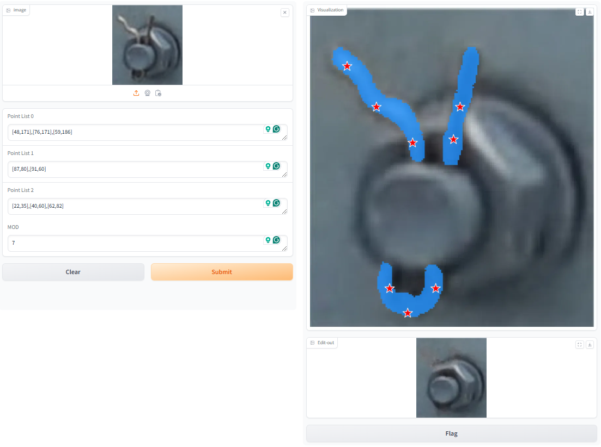

# SBDE: A Segmentation-driven Editing Framework for Bolt Defect Augmentation and Detection
Official repository for SBDE: A Segmentation-driven Editing Framework for Bolt Defect Augmentation and Detection

## Online Demo will be released soon (Recommended).

## Requirements
*Python 3.8 \\
*PyTorch 2.4.1

## Todo
This code combines different tasks and is quite complex. We will organize this work in the future.

## Acknowledgements
This code refers to the projects: [RobustSAM](https://github.com/robustsam/RobustSAM), [SAM-Adapter](https://github.com/tianrun-chen/SAM-Adapter-PyTorch) and [LaMa](https://github.com/advimman/lama) Thanks for their excellent work！
